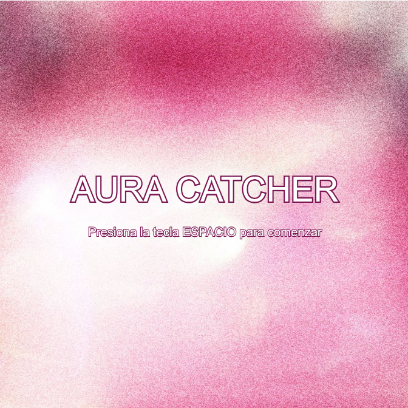
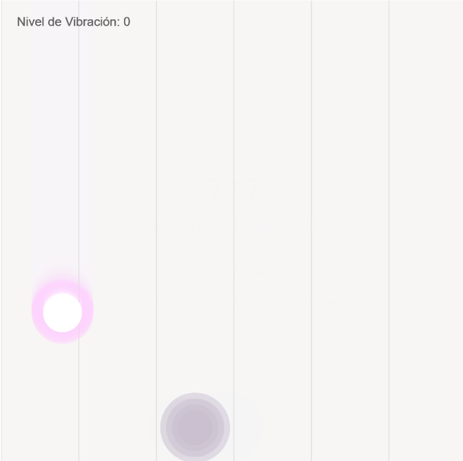
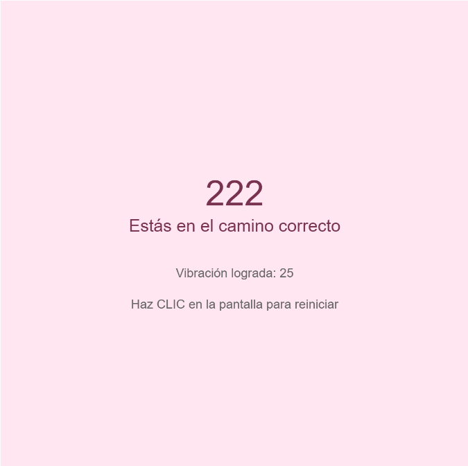
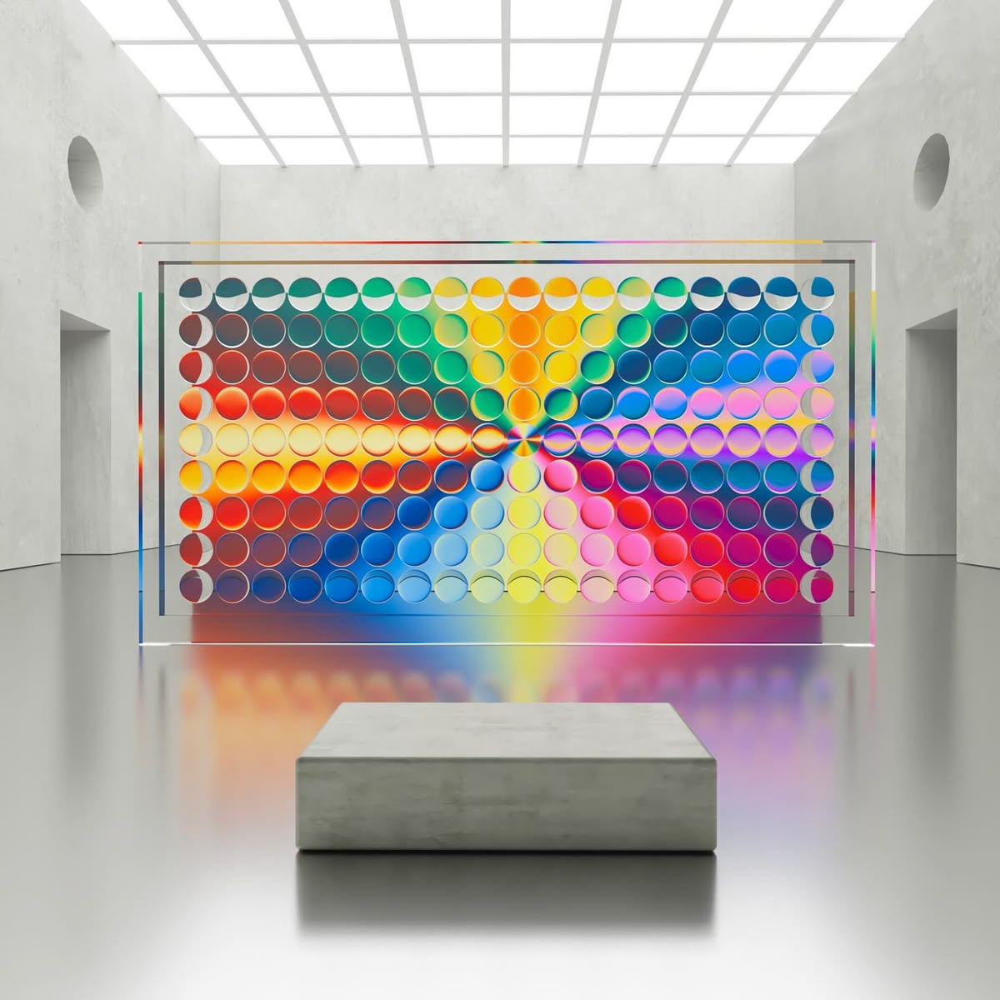
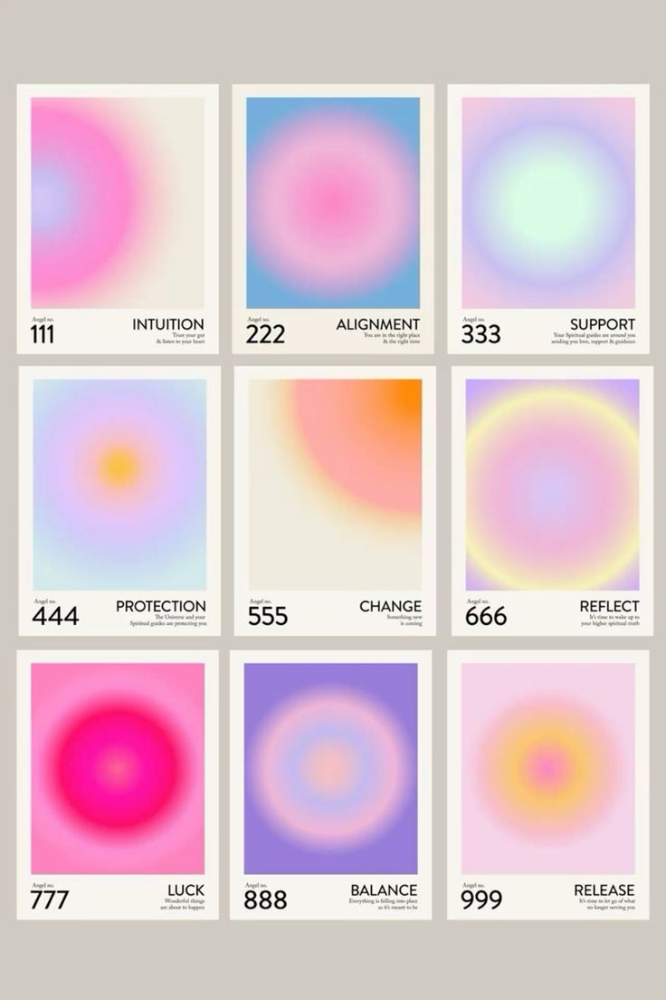
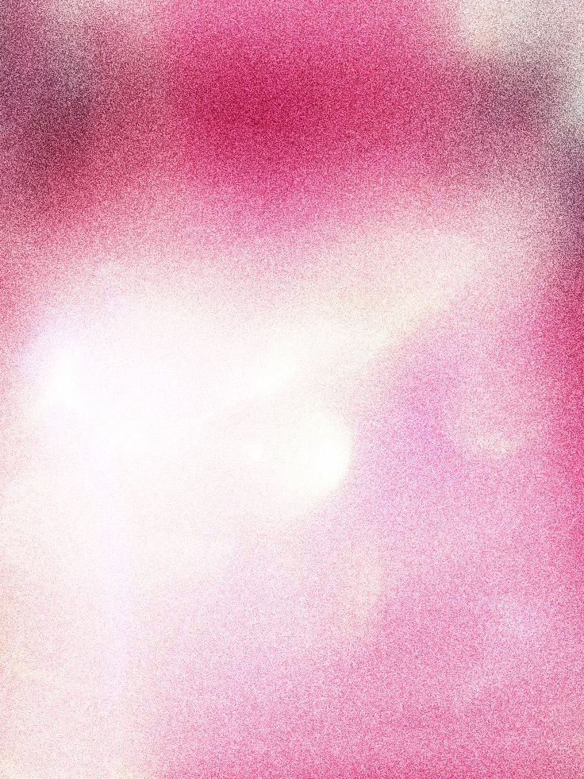
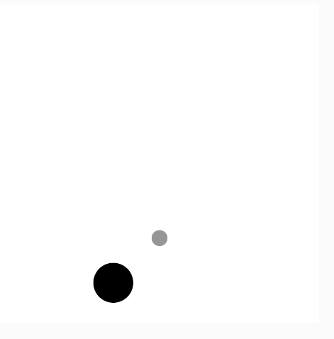

# EXAMEN FINAL PENSAMIENTO COMPUTACIONAL

## Nombre del proyecto: AURA CATCHER
## Autora: Francisca Plaza
---

Link P5.js jugable
- https://editor.p5js.org/francisca.plaza1/full/ZN1DXvsgK
  
Link P5.js editable
- https://editor.p5js.org/francisca.plaza1/sketches/ZN1DXvsgK

---
Para mi examen final quise seguir mi idea de auras, ecos y arte cinético de mi solemne pasada ya que me gustó el resultado y lo vi adecuado para el examen.

---
# Descripción objetiva
- **Qúe es el proyecto**: Este trabajo consiste en un sistema visual interactivo que toma la forma de un juego simple programado. En ste caso, con mi solemne pasada, mi juego simula la recolección de frecuencias energéticas que caen del lienzo y hay que atraparlas.
- **Qué se ve en la pantalla**: El juego tiene tres pantallas. La primera es el menú inicial con una imagen de fondo rosada y texto. La segunda es el juego en sí, que tiene un fondo casi blanco que deja una estela o un eco cuando las cosas se mueven, una grilla de fondo, el círculo que cae y un aura en la parte inferior que sigue al mouse. La tercera pantalla es el menú final de color pastel que muestra tu puntaje y un mensaje.
- **Qué elementos visuales aparecen**: Círculos con distintos niveles de opacidad, líneas simples para la grilla, texto y una imagen al inicio. 
- **Qué inputs utiliza**: El movimiento del mouse en el eje horizontal (`mouseX`), la barra espaciadora del teclado (`key`) y el clic del mouse (`mousePressed`).
- **Qué outputs genera**: Gráficos que se actualizan todo el tiempo, música de fondo que se prende y se apaga, y textos que cambian al azar.

  # Descripción conceptual
  - **Idea central**: El juego se trata de sintonizar con buenas energías. Mi idea era que, en lugar de que "perder" fuera algo frustrante, el juego te entregara una recompensa visual y emocional. Por eso, cuando el círculo toca el borde del canvas, el juego te da un mensaje motivacional al final. 
  - **Referente de diseño**: Cómo mi solemne pasada, seguí las ideas de arte cinético, utilizando auras y mensajes motivacionales con números guía o espejo.
    

  - **Principio de diseño explorado**: Trabajé mucho el contraste y la armonía visual. Por ejemplo, en vez de usar bordes negros en el texto del menú inicial, usé la herramienta de cuentagotas en illustrator para sacar un tono magenta oscuro de la foto de fondo y lo usé para los trazos (`stroke`), logrando que todo combine mejor.

---
## Sistema computacional
- **Inputs:**
  * `mouseX`: Lee dónde está el cursor del usuario para mover el aura/círculo.
  * Teclado: Detecta si se presiona la tecla de espacio.
  * Clic: Detecta si el usuario hace clic para reiniciar el juego.
- **Procesos:**
  * **Gravedad:** Sumar valores a la variable `caidaY` en cada fotograma para que la pelota baje, haciéndola más rápida a medida que sube el `puntaje`.
  * **Cambio de color:** Usar la función `map()` para que el color del aura cambie dependiendo de si el mouse está más a la izquierda o a la derecha.
  * **Colisiones:** Usar condicionales `if` para calcular si la posición de la pelota choca con la posición del jugador, o si la pelota se pasó del límite inferior de la pantalla.
  * **Azar:** Usar la función `random()` para que la pelota caiga desde distintas posiciones en `X`, y para elegir al azar el mensaje final del 1 al 5.
* **Estados:**
  * `estado 0` (Menú): Pantalla estática de inicio.
  * `estado 1` (Juego): Donde funcionan las mecánicas, la gravedad y la música.
  * `estado 2` (Fin): El juego se detiene, la música para y se muestra el resultado final.
* **Eventos:**
  * `preload()`: Para cargar la foto y la música antes de que empiece todo.
  * `setup()`: Para crear el tamaño del lienzo y dar las configuraciones iniciales.
  * `draw()`: El ciclo principal que dibuja todo 60 veces por segundo.
  * `keyPressed()` y `mousePressed()`: Eventos que solo pasan cuando el usuario toca algo.
* **Outputs:**
  * Visualización gráfica en la pantalla de p5.js.
  * Reproducción de audio.
  * Textos variables (el número de la suerte y la frase).
 
  ## Diagrama de flujo
  ` para transformar ese mismo número de posición en un número de color RGB. Al mismo tiempo, el sistema suma números constantemente a `caidaY` para generar el movimiento de la pelota.
3. **Qué respuestas producen:** Si el jugador logra interceptar la pelota (los valores de X e Y coinciden en el `if`), el sistema responde dándole 1 punto, subiendo la dificultad y devolviendo la pelota arriba. Si el jugador falla y la pelota llega al piso, el sistema responde cambiando el estado a 2, apagando la música y mostrando el mensaje angelical en pantalla.

---

## Explicación de la Interacción
- **Qué datos entran al sistema:** P5.js lee la posición del mouse del jugador y si este presiona teclas o hace clics.
-  **Cómo se procesan y transforman:** El programa usa la posición del mouse para mover el círculo/aura y cambiar su color usando la función map(). Al mismo tiempo, simula la gravedad sumándole valores constantemente a la posición del circulo (caidaY) para que caiga hacia el piso.
- **Qué respuestas producen:** Si atrapas el circulo, ganas 1 punto, aumenta la velocidad de caída y el circulo vuelve arriba. Si fallas y la pelota toca el piso, el juego termina (pasa al estado 2): la música se apaga y aparece el mensaje en pantalla.

---

## Recursos Multimedia Utilizados
* **Imagen (`fotofondomenuexamenpc.jpg`):** Se usa como fondo de la pantalla de inicio. Su función es establecer la paleta de colores y el ambiente relajante del proyecto desde el primer segundo.

* **Audio (`musicafondoexamenpc.mp3`):** Es una pista ambiental. No está solo de adorno, sino que cumple una función en la lógica de estados: se enciende (`loop`) solo en el estado de juego y se apaga de golpe (`stop`) en el estado de pérdida, ayudando a que el usuario entienda qué está pasando.

  ![foto carga de archivos](

---

## Registro Visual

* **Referentes:** Me inspiré en las gráficas de meditación, el arte vaporwave y los colores de los atardeceres.
* **Bocetos e Iteraciones:**
  * *Primera prueba:* Empecé con figuras geométricas simples y bordes negros para probar que el código de atrapar la pelota funcionara.
  

  * *Segunda prueba:* Añadí el aura a los circulos y que se formara el eco. Probé las pantallas de inicio y final con texto.
    . Esto hizo que mi código fuera mucho más fácil de leer, de ordenar en la pantalla y de explicar. También decidí pintar el fondo del juego con un nivel de transparencia (alfa) en vez de un color sólido, lo que generó un efecto visual de "estela" o eco súper interesante para representar las energías.
* **Dificultades encontradas:** Lo que más me costó fue entender cómo controlar la música para que no se reprodujera muchas veces encima de sí misma, y lograr que se detuviera exactamente en el momento en que la pelota tocaba el suelo usando la lógica de los estados.
* **Aprendizajes obtenidos:** Aprendí a estructurar un código completo usando la lógica de "Estados" (0, 1 y 2). Entendí que un proyecto no es solo un lienzo que reacciona, sino un sistema que puede evolucionar por sí solo (como la gravedad que aumenta) y cambiar sus propias reglas dependiendo de la etapa en la que esté.

---

## Presentación Final
En la exposición oral me enfocaré en:
1. **Concepto:** Cómo relacioné atrapar energías con los Angel Numbers.
2. **Sistema y Estados:** Explicaré cómo el uso de la variable `estado` me permitió organizar el inicio, el juego y el fin sin que el código chocara entre sí.
3. **Evolución:** Demostraré que mi proyecto no es solo reactivo, sino que tiene matemáticas autónomas (la gravedad) que aumentan la dificultad progresivamente dependiendo del puntaje.
