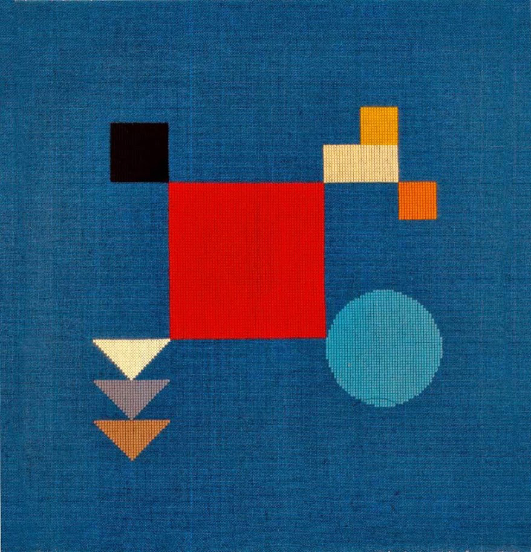
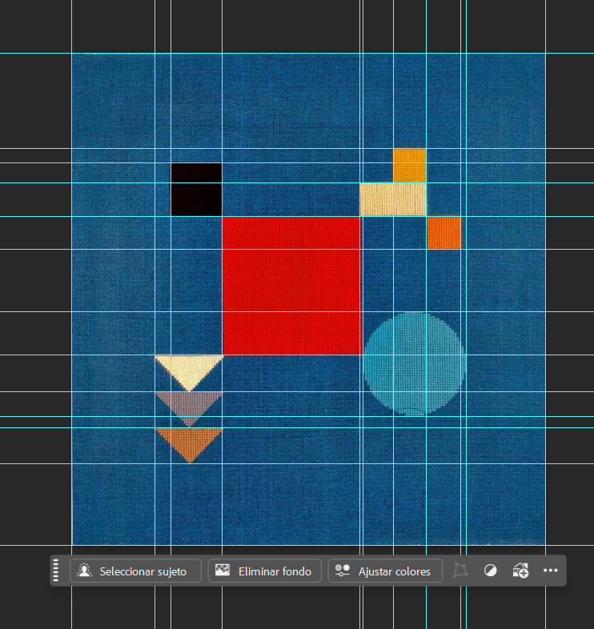
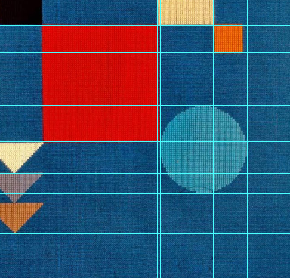
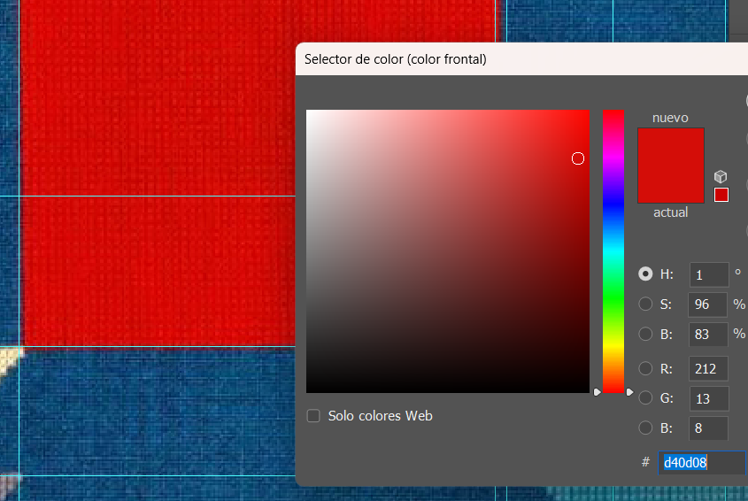
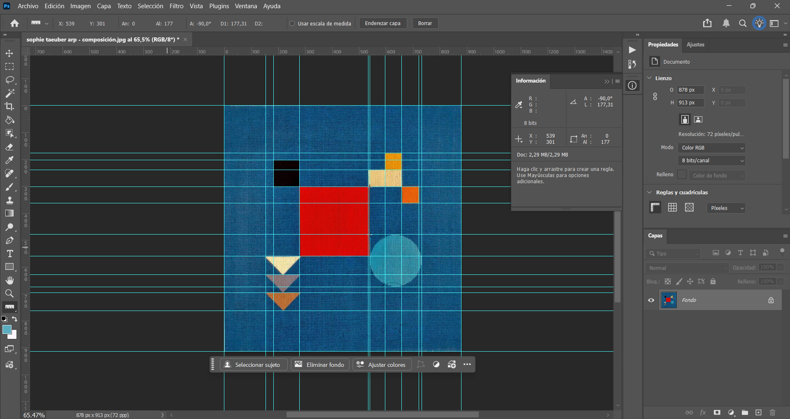
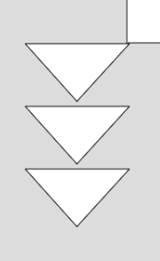
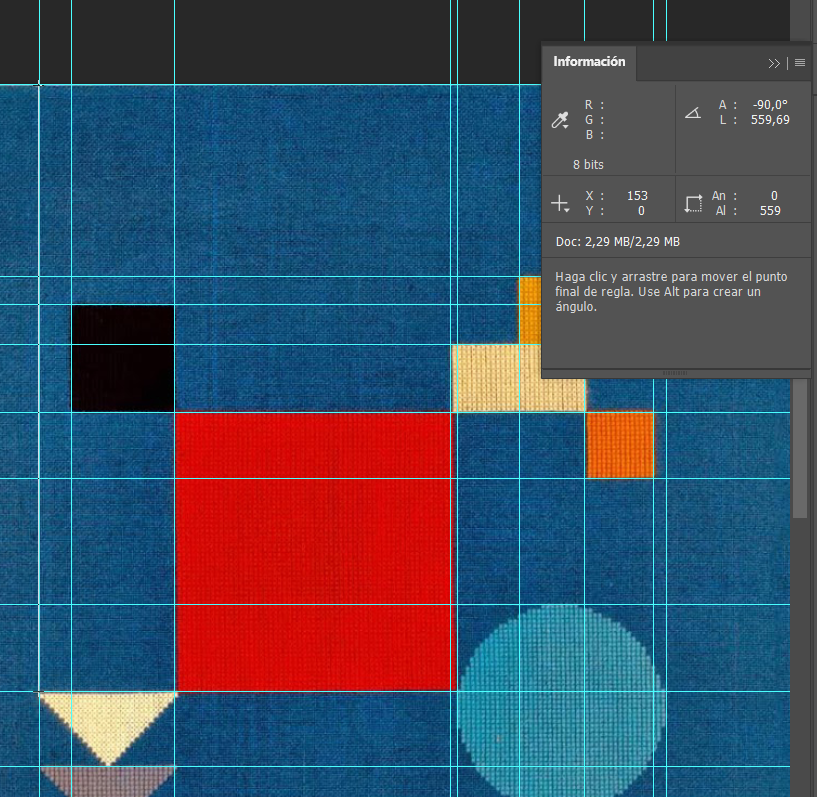

# Pensamiento-computacional.s3
## Sobre este repositorio
Documentación de todo mi proceso en clases, entregas y solemnes. 

## Sketch 1 - Mi primer p5.js:
- Qué intenté hacer: Intenté recrear la portada de un albúm de mi grupo favorito que justamente usan figuras geometricas y fáciles de recrear en p5.js, además que aporveché que sabía realizar bien los circulos, y la portada es así.
- Qué aprendí: Aprendí a poner bien las coordenadas de X e Y. Pensé que se me iba a complicar mucho el averiguar como posicionarlos donde quería, pero con práctica me salió bien en mi opinión.
- Qué no salió: El último circulo tiene una especie de H encima del circulo. Se me complicó el intentar ponerlo justo como en la foto, además que se me acabó el tiempo para arreglarlo. 

[P5.js](https://editor.p5js.org/francisca.plaza1/sketches/Imqa5GRPT)

*Recreación P5.js*

*Portada original*

## Solemne n1 -Réplica de obra abstracta.
- *Nombre de la obra: Composición vertical-horizontal, 1916.*
No encontré registro de un nombre 100% oficial.
- *Autora: Sophie Taeuber-Arp*
 

- **Por qué elegí la obra:** Esta obra la escogí ya que me gustó la armonía de la composición y su paleta de colores. Además, el hecho de que sea una obra bordada le da una nueva técnica para la actualidad. Sabiendo que estas páginas no existían antes, dejando las composiciones totalmente a mano y el ahora poder recrearlas con la tecnología me parece muy interesante.
- **Cómo la analicé:** Me gustó el orden que tiene la obra, es homógeneo pero aún así llama la atención. La obra no es 100% simetrica, pero tiene un equilibrio que llama la atención. El gran cuadrado rojo genera un tipo de pesadez visual, mientras que las figuras pequeñas de sus costados ayudan a mantener una buena visual. El círculo siendo la única figura sin ángulos rectos rompe la rígidez de la obra. El azul del fondo ayuda mucho a contrastar con el cuadrado rojo, la figura principal que llama al espectador a observar la obra.
- **Cómo traduje la imágen:** Para traducir la obra a P5.js, seguí el consejo que dio la profesora. Descargué la obra original y la abrí en Photoshop. Allí tomé los píxeles exactos que medía la obra.

*Posicioné las reglas en cada borde de cada figura*

*Con la herramienta del gotero fui escogiendo los colores para cada figura y copié los número RGB*

*Así se veía mi mesa de trabajo:*

 
 

- **Qué dificultades tuve:** Al principio me costó mucho saber la distancia que debía tener cada figura y qué coordenadas. El uso de Photoshop me facilitó bastantes cosas, pero en el momento no entendía nada de como usar la X e Y. Tuve que ver tutoriales e ir básicamente probando con números aleatorios hasta lograr una coordenada parecida a la de la obra. Los triángulos fueron los que más me costó descifrar como posicionarlos uno bajo el otro.

  *Aquí se logra ver como estaban un poco separados*

  

  
- **Cómo lo resolví:** Usé la "herramienta regla" de Photoshop, y en la ventana "Información" me iba indicando los valores de X e Y, así mismo el ancho y alto de cada figura. Posicionaba la regla de extremo a extremo, así dándome sus valores correspondientes. Para la distancia de cada triángulo, tomé la herramienta regla y la posicioné en el borde superior de la imagen y la bajé hasta el comienzo del triángulo. Luego, iba bajando hasta el otro comienzo del otro triángulo. Le agarré el ritmo de a poco y luego fue menos tedioso de realizar. De hecho, me emocionaba cada vez que quedaba igualito al de la obra.

  

En resumen, me gustó realizar este trabajo. Fue algo totalmente nuevo para mi. Nunca antes había programado o hecho algo de este estilo, salí de mi zona de comfort con esta solemne. 
